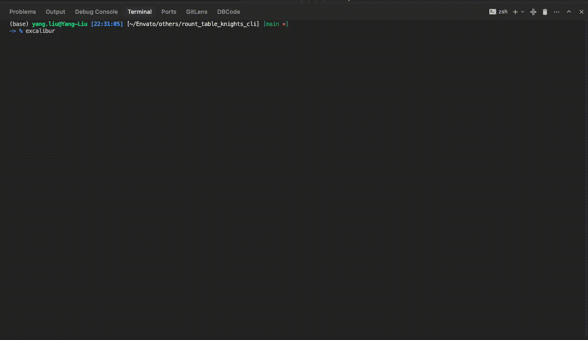

# ⚔️ Excalibur CLI (圆桌骑士 CLI)

```
███████╗██╗  ██╗ ██████╗ █████╗ ██╗     ██╗██████╗ ██╗   ██╗██████╗
██╔════╝╚██╗██╔╝██╔════╝██╔══██╗██║     ██║██╔══██╗██║   ██║██╔══██╗
█████╗   ╚███╔╝ ██║     ███████║██║     ██║██████╔╝██║   ██║██████╔╝
██╔══╝   ██╔██╗ ██║     ██╔══██║██║     ██║██╔══██╗██║   ██║██╔══██╗
███████╗██╔╝ ██╗╚██████╗██║  ██║███████╗██║██████╔╝╚██████╔╝██║  ██║
╚══════╝╚═╝  ╚═╝ ╚═════╝╚═╝  ╚═╝╚══════╝╚═╝╚═════╝  ╚═════╝ ╚═╝  ╚═╝

⚔️  EXCALIBUR CLI - Multi-Agent Debate Engine
```

**Excalibur CLI** coordinates AI agents in structured debates to reach consensus on solutions. Features interactive terminal.



## Features

- **Interactive Terminal** — Live command filtering, tab completion, arrow navigation, ESC to kill agents
- **Structured Debates** — Proposal → critique → vote cycles until consensus
- **Consensus Modes** — Unanimous, super-majority, or majority with configurable thresholds
- **Quality Control** — Rubber-stamp penalties and owner approval requirements
- **Smart Logging** — Per-agent logs with emoji avatars and human-readable transcripts

## Usage

### Interactive Mode (Default)
```bash
node index.js
```

### Command Line Mode
```bash
node index.js "Your question here" --preset=team --consensus=super --maxRounds=5
```

### Interactive Commands
- `/help` or `-h` - Show help
- `/question` or `-q` - Ask a question (or just type directly)
- `/exit` - Exit the CLI

## Project Context Awareness

**🎯 Key Feature: Agents can access your project files when debating solutions!**

When you run Excalibur from within a project directory, the AI agents can:
- **Read your codebase** - Access source files, configs, and documentation
- **Understand your stack** - Analyze package.json, requirements.txt, etc.
- **Review your patterns** - Learn from existing code style and architecture
- **Provide contextual solutions** - Suggest implementations that fit your project

### Examples of Project-Aware Debates:

```bash
# In a Node.js project directory
excalibur "How should I implement authentication for this API?" --preset=team

# In a Python project directory
excalibur "Optimize this database query performance" --preset=team

# In a React project directory
excalibur "Add error boundary handling to this component" --preset=team
```

The agents will analyze your existing code and debate solutions that:
- ✅ Match your existing patterns and conventions
- ✅ Use libraries you already have installed
- ✅ Follow your project's architecture
- ✅ Consider your specific requirements and constraints

**💡 Pro Tip:** The more context your agents have about your project, the better their solutions will be!

## Installation From Source

```bash
npm install -g .
```
Then
```bash
excalibur "Explain how to stream large CSVs into Postgres safely." --preset=team --consensus=super --maxRounds=5
```


## Requirements

- Node.js ≥ 18 (for ECMAScript modules)
- Each agent CLI must be installed and runnable (adjust `agents.json` to match your CLIs)

## Configuration

### Agent Configuration

Agents are defined in `agents.json` with their CLI commands, timeouts, and display settings. Excalibur looks for this file in the following order:

1. `~/.excalibur/agents.json` (user config - **recommended for global installs**)
2. `./agents.json` (current directory - for project-specific configs)
3. Package directory (fallback default)

When installed globally via `npm install -g excalibur`, the default config is automatically copied to `~/.excalibur/agents.json` for easy editing.

**To configure your agents:**
```bash
# Show current config location and status
excalibur --config

# Edit your personal config (global install)
open ~/.excalibur/agents.json

# Or create a project-specific config
cp ~/.excalibur/agents.json ./agents.json
```

### Common Flags

| Flag | Description |
| --- | --- |
| `--maxRounds=N` | Maximum critique/vote cycles (default 5) |
| `--consensus=MODE` | `unanimous`, `super` or `majority` (default `super`) |
| `--preset=NAME` | Apply preset: `strict`, `default`, `fast`, `experiment`, `team` |
| `--owner=ID1,ID2` | Require specific agents to approve winner |
| `--ownerMin=N` | Minimum score threshold for owner approval (default 0.8) |
| `--ownerMode=MODE` | Owner approval mode: `any` or `all` (default `any`) |
| `--logDir=DIR` | Directory for logs (default `logs`) |
| `--quiet` | Suppress console output |
| `--no-color` | Disable ANSI colors |

### Owner Approval System

The owner approval system adds an additional quality gate after consensus is reached. Even if agents reach consensus on a winner, designated "owner" agents must have personally rated the winning proposal above a minimum threshold during the voting phase.

#### Configuration

```bash
# Require Claude to approve the winner with at least 0.8 score
node index.js "Your question" --owner=claude --ownerMin=0.8

# Require both Claude and Gemini to approve (all mode)
node index.js "Your question" --owner=claude,gemini --ownerMode=all --ownerMin=0.85

# Interactive mode: Configure via settings and save to config
node index.js
# Use /config command to set owner preferences
```

#### How It Works

1. **Voting Phase**: All agents (including owners) vote on proposals
2. **Consensus Check**: System determines if there's a winning proposal
3. **Owner Validation**: If owners are configured, the system checks:
   - Did the owner agent vote during the voting phase?
   - Did they score the winning proposal ≥ `ownerMin` threshold?
4. **Approval Decision**:
   - `ownerMode=any`: At least one owner must approve
   - `ownerMode=all`: All designated owners must approve

#### Example Output

When owner approval is being evaluated, you'll see detailed logging from each owner agent:

```
│ [owner-approve] 🦉 Claude CLI ➤ I approve codex's proposal for consensus. During voting, I rated it 0.92/1.0, which meets the owner threshold of 0.8.

│ [owner-reject] 💎 Gemini CLI Pro ➤ I reject codex's proposal for consensus. During voting, I rated it 0.75/1.0, which is below the required owner threshold of 0.8.
```

This ensures that designated "expert" agents must have personally endorsed the winning solution during the democratic voting process, adding an extra layer of quality assurance to the consensus mechanism.

## Development

Uses only built-in Node modules. Customize prompts in `prompts/*.md` files without touching JavaScript code.

## License

MIT License - see [LICENSE](LICENSE) file for details.