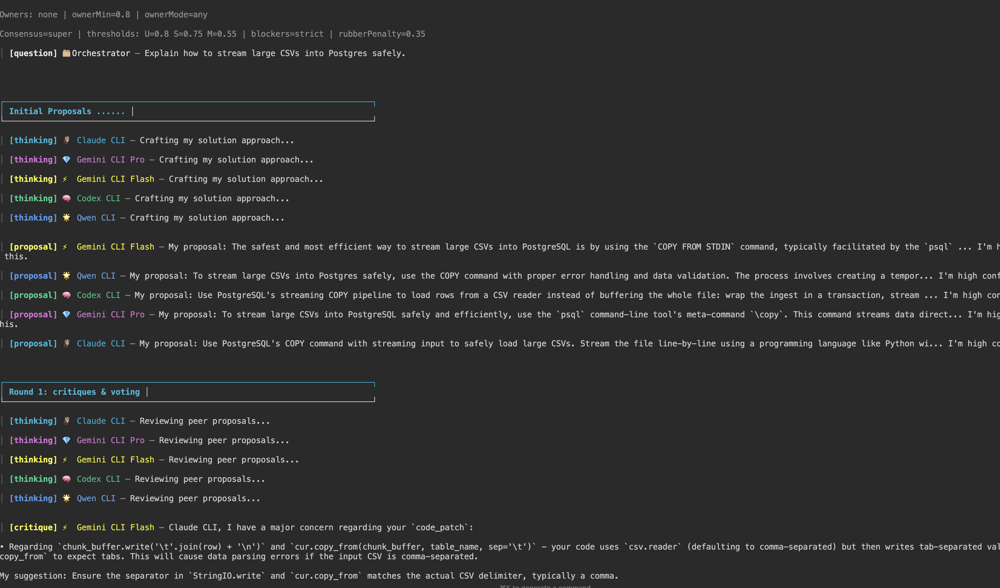

# ⚔️ Excalibur CLI (圆桌骑士 CLI)

```
███████╗██╗  ██╗ ██████╗ █████╗ ██╗     ██╗██████╗ ██╗   ██╗██████╗
██╔════╝╚██╗██╔╝██╔════╝██╔══██╗██║     ██║██╔══██╗██║   ██║██╔══██╗
█████╗   ╚███╔╝ ██║     ███████║██║     ██║██████╔╝██║   ██║██████╔╝
██╔══╝   ██╔██╗ ██║     ██╔══██║██║     ██║██╔══██╗██║   ██║██╔══██╗
███████╗██╔╝ ██╗╚██████╗██║  ██║███████╗██║██████╔╝╚██████╔╝██║  ██║
╚══════╝╚═╝  ╚═╝ ╚═════╝╚═╝  ╚═╝╚══════╝╚═╝╚═════╝  ╚═════╝ ╚═╝  ╚═╝

⚔️  EXCALIBUR CLI - Multi-Agent Orchestration Engine
```

**Excalibur CLI** coordinates AI agents in structured debates to reach consensus on solutions. Features interactive terminal.



## Features

- **Interactive Terminal** — Live command filtering, tab completion, arrow navigation, ESC to kill agents
- **Structured Debates** — Proposal → critique → vote cycles until consensus
- **Consensus Modes** — Unanimous, super-majority, or majority with configurable thresholds
- **Quality Control** — Rubber-stamp penalties and owner approval requirements
- **Smart Logging** — Per-agent logs with emoji avatars and human-readable transcripts

## Usage

### Interactive Mode (Default)
```bash
node index.js
```

### Command Line Mode
```bash
node index.js "Your question here" --preset=team --consensus=super --maxRounds=5
```

### Interactive Commands
- `/help` or `-h` - Show help
- `/question` or `-q` - Ask a question (or just type directly)
- `/exit` - Exit the CLI

## Installation From Source

```bash
npm install -g .
```
Then
```bash
excalibur "Explain how to stream large CSVs into Postgres safely." --preset=team --consensus=super --maxRounds=5
```


## Requirements

- Node.js ≥ 18 (for ECMAScript modules)
- Each agent CLI must be installed and runnable (adjust `agents.json` to match your CLIs)

## Configuration

Agents are defined in `agents.json` with their CLI commands, timeouts, and display settings.

### Common Flags

| Flag | Description |
| --- | --- |
| `--maxRounds=N` | Maximum critique/vote cycles (default 5) |
| `--consensus=MODE` | `unanimous`, `super` or `majority` (default `super`) |
| `--preset=NAME` | Apply preset: `strict`, `default`, `fast`, `experiment`, `team` |
| `--owner=ID1,ID2` | Require specific agents to approve winner |
| `--logDir=DIR` | Directory for logs (default `logs`) |
| `--quiet` | Suppress console output |
| `--no-color` | Disable ANSI colors |

## Development

Uses only built-in Node modules. Customize prompts in `prompts/*.md` files without touching JavaScript code.

## License

MIT License - see [LICENSE](LICENSE) file for details.